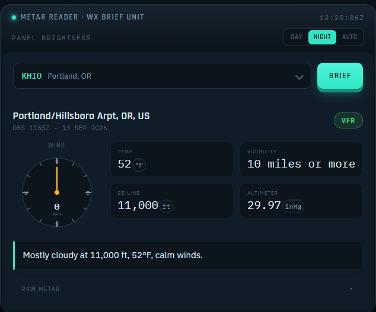

# Metar Reader

Metar Reader is an ASP.NET Core web app that translates METAR — the cryptic,
standardized format pilots and airports use to report weather — into plain
English. Pick an airport, and it fetches the current observation from the
[National Weather Service's Aviation Weather Center](https://aviationweather.gov/)
and reads it back to you the way a human would:

> Overcast at 700 ft with light rain, 73°F, wind 10 mph from the south-southeast.

The UI leans into that aviation theme: an animated airport "tuner," a wind
compass dial, an FAA flight-category badge (VFR/MVFR/IFR/LIFR), and a
day/night/auto panel-brightness switch, styled like a glass-cockpit weather
briefing display.



## Features

- **Plain-English decoding** — sky condition, temperature, wind (with gusts
  and direction), visibility, present weather (rain, snow, fog, thunderstorms,
  etc.), and altimeter setting, all translated from raw METAR fields into a
  natural sentence.
- **Flight category badge** — VFR/MVFR/IFR/LIFR, computed from ceiling and
  visibility using the standard FAA thresholds.
- **Wind dial** — a compass rose that shows direction and speed at a glance.
- **Day / Night / Auto themes** — a panel-brightness toggle that remembers
  your choice and, in Auto, follows your system's color scheme.
- **Raw METAR** — the original text is always one click away for anyone who
  wants to read it themselves.
- **Curated airport list** — aviationweather.gov only supports lookup by known
  station id (no general "list all airports" search), so the app ships with a
  list of ~65 major airports. See [Adding airports](#adding-airports) below.

## How it works

```
Browser  ──▶  Razor Page (Index)  ──▶  IAviationWeatherClient  ──▶  aviationweather.gov
   ▲                  │                                                    │
   │                  ▼                                                    │
   └───────  JSON { summary, details, ... }  ◀──  MetarDecoder  ◀──────────┘
```

Selecting an airport and clicking **Brief** calls a small JSON endpoint
(`GET /?handler=Weather&icao=KHIO`), which fetches the latest observation and
runs it through `MetarDecoder` before returning it to the page. No page
reload is needed — the result panel updates in place.

## Project structure

```
Metar-Reader/
├─ src/
│  ├─ MetarReader.Core/        Decoding logic and the aviationweather.gov client (no ASP.NET dependency)
│  │  ├─ Models/                Airport, MetarObservation, DecodedMetarReport, CloudLayer
│  │  ├─ Weather/               MetarDecoder + the individual decoders (wind, sky, visibility,
│  │  │                         present weather, unit conversions, flight category)
│  │  ├─ Clients/               IAviationWeatherClient / AviationWeatherClient
│  │  └─ Data/                  The curated airport catalog
│  └─ MetarReader.Web/          The ASP.NET Core Razor Pages app (UI)
├─ tests/
│  └─ MetarReader.Tests/        xUnit tests for the decoding logic
└─ MetarReader.sln
```

`MetarReader.Core` deliberately has no dependency on ASP.NET Core — all the
METAR-decoding rules are plain, unit-testable C#.

## Prerequisites

- [.NET 9 SDK](https://dotnet.microsoft.com/download/dotnet/9.0) or later

## Getting started

```bash
git clone https://github.com/Usman9108/Metar-Reader.git
cd Metar-Reader
dotnet run --project src/MetarReader.Web
```

Then open the URL printed in the console (typically `http://localhost:5000`
or `https://localhost:5001`). The app calls aviationweather.gov directly, so
an internet connection is required to fetch live weather.

## Running the tests

```bash
dotnet test
```

## Adding airports

The airport picker is backed by a static list in
[`src/MetarReader.Core/Data/AirportCatalog.cs`](src/MetarReader.Core/Data/AirportCatalog.cs).
To add an airport, add an `Airport(IcaoId, City, Name)` entry to the list —
no other changes are needed, as long as the ICAO id is a station
aviationweather.gov reports METARs for.

## Data source

Weather data is provided by the U.S. National Weather Service's
[Aviation Weather Center API](https://aviationweather.gov/data/api/).
This project is not affiliated with or endorsed by the NWS or FAA.
